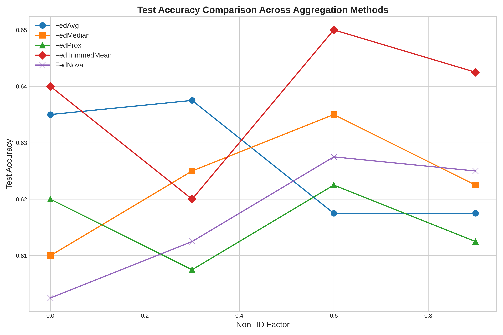
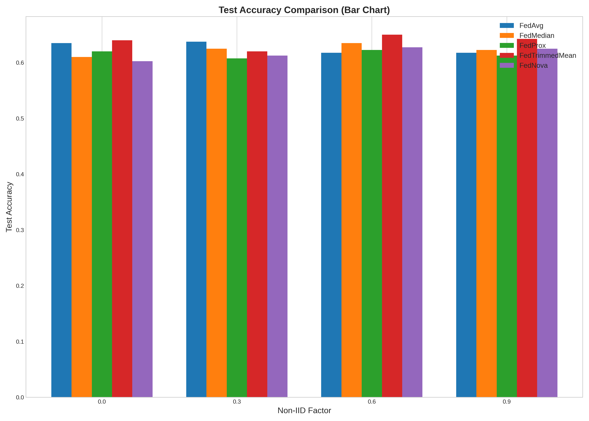
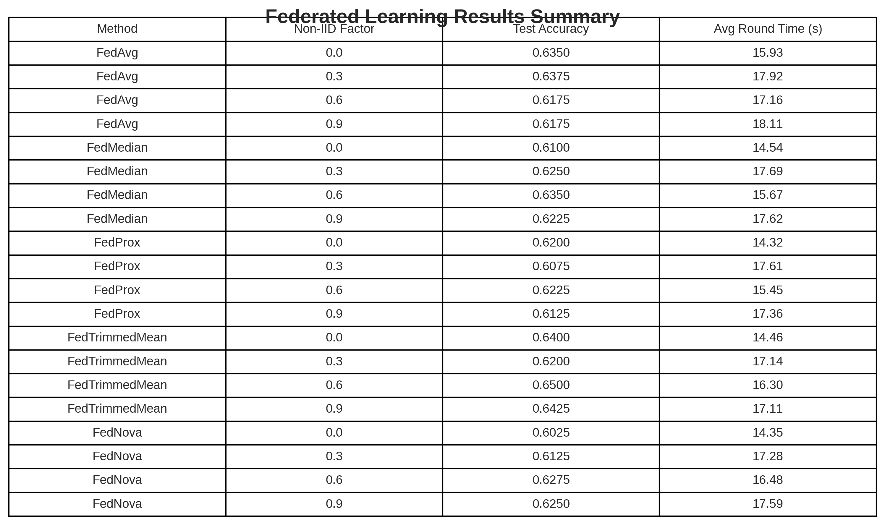

# FedHeurAgg: Federated Learning Aggregation for Chest X-rays

## 📋 Project Overview
This repository implements a federated learning framework for medical image classification, specifically focused on pneumonia detection in chest X-rays. The project presents a novel aggregation method called **FedHeurAgg** that dynamically weights client contributions based on performance metrics, data characteristics, and gradient behavior.



## 🌟 Key Features
- **Multiple Aggregation Methods**: Implements 6 different aggregation strategies (FedAvg, FedHeurAgg, FedMedian, FedProx, FedTrimmedMean, FedNova)
- **Non-IID Experimentation**: Configurable non-IID distribution factors to simulate real-world heterogeneity
- **Adaptive Weighting**: Novel heuristic-based client importance scoring
- **Comprehensive Evaluation**: Detailed metrics and visualizations for comparative analysis
- **Memory-Efficient Design**: Optimizations for resource-constrained environments

## 🔧 Installation

```bash
git clone https://github.com/anonymousneural/Federated-Learning-Aggregation-for-Chest-X-rays.git
cd Federated-Learning-Aggregation-for-Chest-X-rays
pip install -r federated-learning/requirements.txt
```

## 📊 Dataset
The project uses the Chest X-ray Pneumonia dataset, containing radiographic images categorized as normal or pneumonia. The dataset structure is:

```
chest_xray/
├── train/
│   ├── pneumonia/
│   └── normal/
├── val/
│   ├── pneumonia/
│   └── normal/
└── test/
    ├── pneumonia/
    └── normal/
```

The framework includes data preprocessing steps such as:
- Image rescaling (1/255)
- Data augmentation (rotation, shifts, zoom, flip, brightness adjustment)
- Class weighting to handle imbalance
- Non-IID data distribution simulation

## 🧠 Method: FedHeurAgg

The FedHeurAgg method introduces a novel approach that determines client importance weights based on:

1. **Data Representativeness**: Clients with more representative data distributions receive higher weights (40%)
2. **Performance Metrics**: Clients showing better accuracy improvement are prioritized (40%)
3. **Gradient Direction**: Clients whose updates better align with the global optimization direction receive higher weights (20%)

This multi-factor weighting strategy allows the model to adapt to heterogeneous client data while maintaining convergence toward optimal global performance.

## 🏗️ Model Architecture
A memory-efficient CNN architecture is employed with:
- 3 convolutional blocks with batch normalization
- MaxPooling layers for spatial dimension reduction
- Dense layers with dropout for regularization
- Binary classification output

## 📈 Experimentation & Results
Experiments evaluate all aggregation methods across varying non-IID factors (0.0, 0.3, 0.6, 0.9). Key metrics include:
- Test accuracy
- Training and validation loss
- Performance convergence rates
- Computation time

Results demonstrate that FedHeurAgg achieves superior performance in highly heterogeneous settings (non-IID factors of 0.6 and 0.9) compared to traditional methods.




## 📁 Project Structure
```
federated-learning/
├── data/
│   └── README.md
├── models/
│   └── README.md
├── results/
│   ├── README.md
│   ├── test_accuracy_comparison.png
│   ├── test_accuracy_bar_chart.png
│   └── results_table.png
├── src/
│   ├── aggregation/
│   │   ├── fedavg.py
│   │   ├── fedHeurAgg.py
│   │   ├── fedmedian.py
│   │   ├── fednova.py
│   │   ├── fedprox.py
│   │   └── fedtrimmedmean.py
│   ├── dataloader/
│   │   └── data_utils.py
│   ├── metrics/
│   │   └── f1_score.py
│   ├── models/
│   │   └── cnn_model.py
│   ├── utils/
│   │   ├── memory.py
│   │   ├── plotting.py
│   │   └── serialization.py
│   ├── config.py
│   └── fed.py
├── LICENSE
├── README.md
└── requirements.txt
```

## ⚙️ Usage
To run the federated learning experiments:

```bash
cd federated-learning
python src/fed.py
```

Modify the configuration settings in `federated-learning/src/config.py` to adjust:
- Dataset path and image size
- Number of clients and local epochs
- Learning rate parameters
- Non-IID factors
- Method-specific hyperparameters

## 🔬 Citations
If you use this code in your research, please cite:

```bibtex
@inproceedings{fedheurAgg2025,
  title={FedHeurAgg: A Novel Heuristic Aggregation Method for Federated Learning on Medical Imaging},
  author={Anonymous},
  booktitle={Conference on Neural Information Processing Systems},
  year={2025}
}
```

## 📄 License
This project is licensed under the MIT License - see the `federated-learning/LICENSE` file for details.

## 🤝 Contributing
Contributions are welcome! Please feel free to submit a Pull Request.

## 📧 Contact
For inquiries, please open an issue in the repository.
